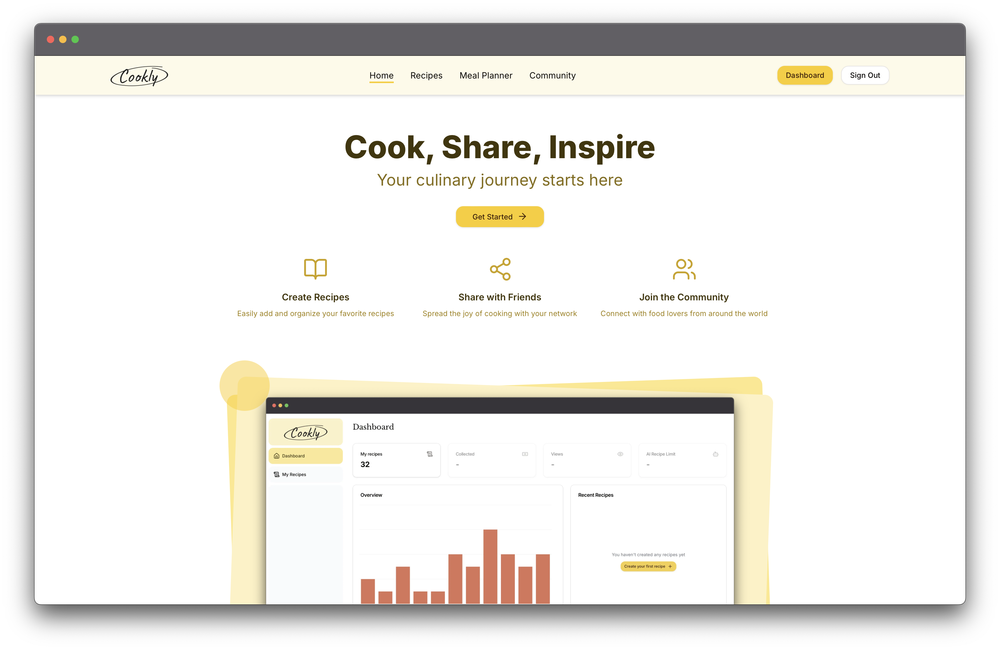

# Cookly App

  <div align="center">
    
    
    
    
  </div>

&nbsp;

<div align="center">
  <a href="https://github.com/kubaparol/cookly-app">
    
  </a>
</div>

&nbsp;

Click to see live version: [Cookly App](https://cookly-app.vercel.app/)!

## Table of Contents

  <ol>
    <li>
      <a href="#overview">Overview</a>
      <ul>
        <li><a href="#features">Features</a></li>
        <li><a href="#tech-stack">Tech Stack</a></li>
        <li><a href="#server-side-actions-and-database-layer">Server-Side Actions and Database Layer</a></li>
        <li><a href="#key-next-js-features">Key Next.js Features</a></li>
      </ul>
        <li><a href="#getting-started">Getting Started</a></li>
    </li>
    <li>
      <a href="#roadmap">Roadmap</a>
    </li>
    <li><a href="#contact">Contact</a></li>
  </ol>

## Overview



**Cookly App** is a recipe management platform that allows users to explore, add, edit, and delete recipes. The app provides a clean, user-friendly interface for discovering and managing recipes, along with user authentication and personalized dashboard.

### Features

- **Authentication**: Users can sign up or log in using [Clerk](https://clerk.com/).
- **Responsive Design**: Built with [Tailwind CSS](https://tailwindcss.com/) for a responsive and visually appealing UI.
- **Public Recipe Browsing**: Users can browse through a list of recipes and view individual recipes without needing to log in.
- **Dashboard**: Once logged in, users can access a dashboard that shows statistics about their recipes and allows them to add new recipes, edit, or delete existing ones.

### Tech Stack

The **Cookly App** is built with a modern, scalable tech stack:

- [React](https://reactjs.dev/) for building the user interface
- [Next.js](https://nextjs.org/) (with App Router and Route Groups)
- [TypeScript](https://www.typescriptlang.org/) for static typing
- [Clerk](https://clerk.com/) for authentication
- [Tailwind CSS](https://tailwindcss.com/) for styling
- [NeonDB](https://neon.tech/) for the database
- [Drizzle ORM](https://orm.drizzle.team/) for database interactions
- [Day.js](https://day.js.org/) for date manipulation
- [uploadthing](https://uploadthing.com/) for image uploads
- [shadcn/ui](https://ui.shadcn.com/) for reusable UI components
- [Lucide](https://lucide.dev/) for customizable icons
- [Recharts](https://recharts.org/) for charting and data visualization
- [pnpm](https://pnpm.io/) for fast, efficient package management
- [ESLint](https://eslint.org/) and [Prettier](https://prettier.io/) for code quality and formatting

### Server-Side Actions and Database Layer

The application uses **server-side actions** to manage database queries efficiently. These actions are organized in a dedicated folder called db, which separates the logic clearly:

- **Schema**: The `schema` folder contains the database table definitions (e.g., `recipes`, `ingredients`, `steps`, etc.), declared using **Drizzle ORM**.
- **Actions**: The `actions` folder contains specific queries and operations that are grouped by functionality:
  - **recipe**: Handles recipe creation, retrieval, updates, and deletion.
  - **statistics**: Fetches statistical data for the user's dashboard.
  - **user**: Manages user-related database operations.

### Key Next.js Features

**Cookly App** leverages some of the latest Next.js features, including:

- **App Router**: Used for structured and scalable routing across the app.
- **Route Groups**: For organizing routes and logically grouping functionality.
- **Special Files**: Includes custom `loading.tsx`, `error.tsx`, and `not-found.tsx` components to handle various states like loading UI, error handling, and 404 pages.
- **Dynamic Metadata**: Automatically generates metadata for each recipe based on its content and ID.
- **Next API Routes**: Used to handle:
  - **Webhooks** from UploadThing for managing image uploads
  - **User creation** in the database after a new user registers with Clerk

## Getting Started

To run the **Cookly App** locally, follow these steps:

1. Clone the repository:

```bash
git clone https://github.com/kubaparol/cookly-app.git
```

2. Install the dependencies:

```bash
pnpm i
```

3. Copy the `.env.example` file, rename it to `.env` and fill required credentials:

```bash
cp .env.example .env
```

4. Run the development server:

```bash
pnpm dev
```

5. App is ready to go:

```
http://localhost:3000/
```

## Roadmap

- [x] User Authentication with Clerk
- [x] Basic Recipe CRUD Functionality
- [x] Dashboard with Recipe Statistics
- [ ] Favorite Recipes
- [ ] Recipe View Statistics
- [ ] Paid Recipes and Monetization Features
- [ ] AI-Generated Recipe Suggestions

## Contact

Feel free to contact me! You can find me here:

- [LinkedIn](https://www.linkedin.com/in/jakub-parol/)
- [GitHub](https://github.com/kubaparol)
