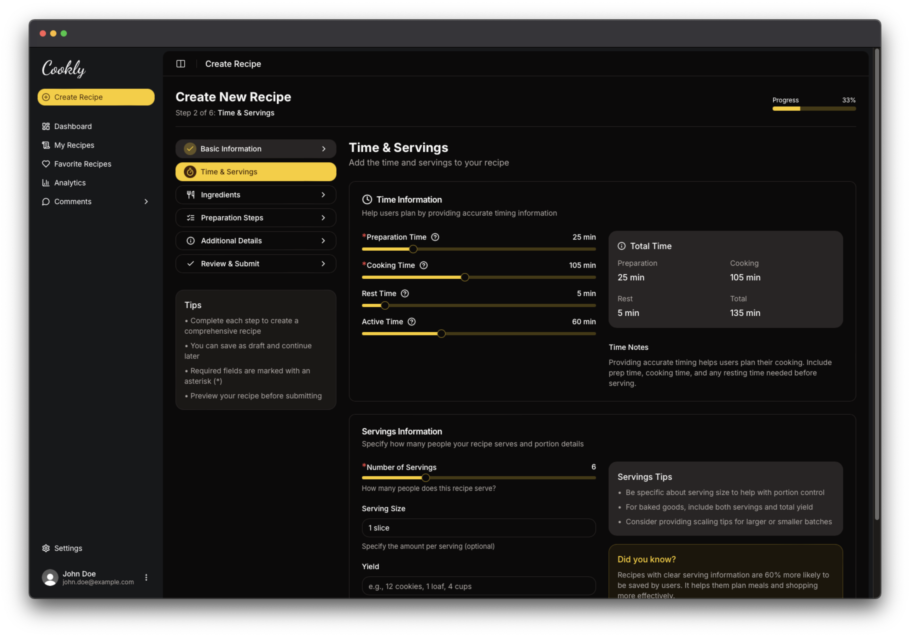

# Cookly App

:fire: Click to see live version: [Cookly App](https://cookly-app.vercel.app/)!

## Overview



**Cookly App** is a recipe management platform that allows users to explore, add, edit, and delete recipes. The app provides a clean, user-friendly interface for discovering and managing recipes, along with user authentication and personalized dashboard.

## Key Features

- **Next.js Features**:

  - **App Router**: Utilizes the new app directory structure for routing.
  - **Suspense**: Implements React Suspense for loading states.
  - **Promise.all**: Efficiently handles multiple asynchronous operations.
  - **Skeletons**: Provides a better user experience during data fetching.
  - **Route Groups**: Organizes routes for better maintainability.
  - **API Routes**: Used to handle:
    - **Webhooks** from UploadThing for managing image uploads
    - **User creation** in the database after a new user registers with Clerk

- **Authentication**:

  - **Clerk**: Custom views for account creation, login, password reminders and OTP input for verification.

- **Responsive Design**:
  - Built with **Tailwind CSS** for a mobile-first approach.

## Technologies Used

- **Frontend**:

  - React
  - Next.js
  - TypeScript
  - Tailwind CSS
  - Radix UI components for accessibility and design consistency.

- **Backend**:
  - Drizzle ORM for database interactions.
  - Neon Database for serverless data storage.

## Server-Side Actions and Database Layer

The application uses **server-side actions** to manage database queries efficiently. These actions are organized in a dedicated folder called db, which separates the logic clearly:

- **Schema**: The `schema` folder contains the database table definitions (e.g., `recipes`, `ingredients`, `steps`, etc.), declared using **Drizzle ORM**.
- **Actions**: The `actions` folder contains specific queries and operations that are grouped by functionality:

## Getting Started

To run the **Cookly App** locally, follow these steps:

1. Clone the repository:

```bash
git clone https://github.com/kubaparol/cookly-app.git
```

2. Install the dependencies:

```bash
pnpm i
```

3. Copy the `.env.example` file, rename it to `.env` and fill required credentials:

```bash
cp .env.example .env
```

4. Run the development server:

```bash
pnpm dev
```

5. App is ready to go:

```
http://localhost:3000/
```

## Roadmap

- [x] User Authentication with Clerk
- [x] Basic Recipe CRUD Functionality
- [x] Dashboard with Recipe Statistics
- [x] Favorite Recipes
- [x] Recipe View Statistics
- [ ] Paid Recipes and Monetization Features
- [ ] AI-Generated Recipe Suggestions

## Contact

Feel free to contact me! You can find me here:

- [LinkedIn](https://www.linkedin.com/in/jakub-parol/)
- [GitHub](https://github.com/kubaparol)
